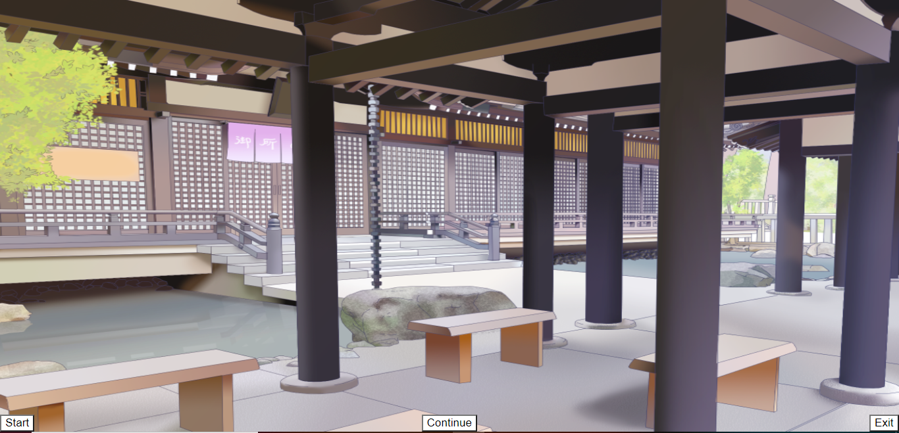
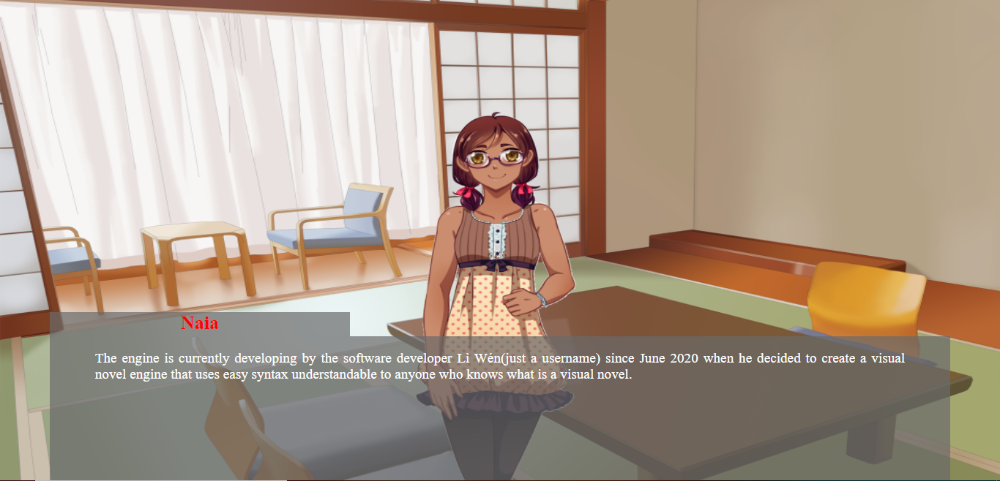

<!---->

<h1>TotoyeVN 2.1</h1>

TotoyeVN 2.1 is a 2D visual novel engine written in JavaScript. The engine was made in a way to offer easy syntax for the development of your games. The first version(1.0.0) was released on Github on June 26 2020 and since, the developer working on it continue to upgrade in order to give you the best engine possible. To learn more see the website ([Li Wen Studios](http://liwenstudios.fun/TotoyeVN.php)).

This repository contains full source code of the engine. As it is a open-source project, anyone is welcome to contribute.

# Development

* [Developer Homepage](http://liwenstudios.fun)
* [Twitter](https://twitter.com/liwenstudios)
* [Become a Patron](https://www.patreon.com/liwenstudios)
* [Documentation](http://liwenstudios.fun/TotoyeVN.php)

# Screenshots

Install TotoyeVN-engine using [npm](https://www.npmjs.com/package/totoyevn-engine):

	npm i totoyevn-engine
									

	
